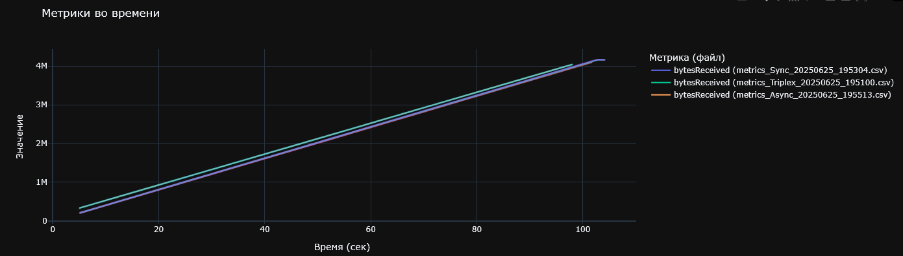

# NETwork

.NET Core implementation of three different network paradigms: Sync, Async and Triplex TCP server. Also includes tools for benchmarking and data visualization;

---

# Disclaimer

Since packet processing is bottleneck in game server emus, preformance is almost the same with all three implementations. Game servers usually characterized by stable connections, frequent packet sending\receiving and moderately high count of clients. So even if your netcode is fast asf, it still can't cure your app in case of poor logic optimization though. If you seek a way to speed up your server - network is not the key to performance :C

The graph is shown below illustrates one of the main metrics I benchmarked during development - latency (ms). Latency represents overall time right from receiving packet on server side to the moment it was sent to the recepient. Strictly, this is not a very accurate metrics in our case, because it should be measured from client side, but it can provide a qualitative assesment of different server pipelines' performance. 

I haven't benchmarked pure model performance without logic pressure yet.

---

# TCP Server Architectures: Sync / Async / Triplex

This project presents an exploration of three TCP server architectures, focusing on performance, multithreaded execution, adaptive backpressure, and real-time metrics collection.

It includes:

- Implementations of server models (`Sync`, `Async`, `Triplex`);
- A traffic generation tool (`TcpWorkloadClient`);
- **A real-time WPF metrics viewer**;
- `BenchmarkRunner` for **scripted testing scenarios**;
- A metrics log analyzer (p`lot_metrics.py` in Python);

---

## Server Architectures

### 🔹 Sync (Single-threaded Pipeline)

- **Architecture:** classic reactor loop;
- **Workflow:** `accept` → `poll` → `read` → `process` → `write`;
- **Buffering:** `Pipe` with double-mapped ring buffer;
- **Characteristics:** minimal latency; limited scalability due to single-threaded design;

### 🔹 Async (Two-threaded Model)

- **Threads:** `NetThread` (polling/receiving/sending) and `LogicThread` (processing/responses);
- **Buffering:** custom `PagingBuffer` (lock-free, single-reader/writer); communication via `ConcurrentQueue`;
- **Backpressure:** `ThreadPidBackPressure` to limit inbound traffic based on target processing time;
- **Use case:** balanced load between network and logic execution;
  
### 🔹 Triplex (Twriple-threaded Model)

- **Threads:** `NetThread`, `LogicThread`, `WriteThread`;
- **Buffering:** same as Async; additional flush queue for sending thread;
- **Backpressure:** `DualPidBackPressure` for logic and write threads;
- **Use case:** improved scalability and isolation under heavy workloads

---

## Metrics

Each server implementation collects high-resolution metrics in real-time:

- **Throughput:** number of packets processed, bytes received/sent;
- **Latency:** computed using timestamp fields in payloads;
- **Backlog:** difference between bytes written and bytes sent;
- **CPU usage:** measured in cycles per second for each thread;
- **Thread activity:** Active time in ticks and percentage, Sleep/yield metrics, thread contention;
- **GC metrics:** total pause time, generation-specific stats;
- **Buffer usage:** current occupancy in Pipe or PagingBuffer;
- **Cold tick workload:** background logic execution independent of network events;

Metrics are streamed to WPFViewer or saved to log files for post-analysis.

---

## BenchmarkRunner

A console utility for benchmarking server configurations under varying workloads. It supports:

- CPU and background workload simulation;
- Series of timed benchmarks;
- Metric collection and logging per run;

---

## WPFViewer

A desktop application that connects to the server and visualizes metrics in real time, including:

- Latency graphs;
- Thread usage;
- GC and allocation metrics;
- Real-time packet/byte counters;

---

## plot_metrics.py

A Python script for processing and comparing saved metric logs:

- Loads CSV logs generated by the server or WPFViewer;
- Plots performance graphs;
- Allows comparing multiple runs/configurations;

---

## TcpWorkloadClient

Traffic generation tool with configurable load profile:

- Multiple concurrent TCP connections;
- Configurable packet generation frequency and size;
- Supports both `finite` (timed) and `infinite` modes;

---

## Launch Arguments

### TcpWorkloadServer

```bash
--mode=<Sync|Async|Triplex>       # server architecture mode
--port=<int>                      # listening port
--infinite                        # disables automatic shutdown
--duration=<int>                  # server lifetime in seconds
--cpuload=<int>                   # processing time per packet (µs)
--sendChance=<float>              # probability of sending a reply
--lowBorder=<int>                 # min packet size for response
--highBorder=<int>                # max packet size for response
--backgroundWorkload=<int>        # background workload time (µs)
```

### TcpWorkloadClient
```bash
--connections=<int>               # number of TCP connections
--finite                          # disables infinite mode
--sendInterval=<int>              # packet send interval (ms)
--lowEnd=<int>                    # min packet size
--highEnd=<int>                   # max packet size
--serverPort=<int>                # server port to connect to
```

---

### PagingBuffer

PagingBuffer is a lock-free circular buffer designed for single-producer/single-consumer use. Features:

- Memory pages linked in a circular list;
- Automatic page reuse and commit;
- Non-blocking access model;

It enables efficient transfer of data between threads with minimal synchronization overhead.

---

# Stack
- .NET 8 / C#;
- WPF (MVVM);
- Low-level socket networking (poll, select);
- PID-based adaptive backpressure;
- Custom memory management (PagingBuffer);
- High-resolution profiling (Stopwatch, CpuCycleMeter);
- Python 3 for log analysis;

---

# Benchmarks

All the following benchmarks have been taken with following configuration:
```bash
Server:
cpuLoad = 330
backgroundWorkload = 30
packetChance = 0.3
lowEnd = 30
highEnd = 40

Client:
connections = 600
sendInterval = 225
lowEnd = 15
highEnd = 21
simulateSendLatencyMs = 50;
sendJitterMs  = 5;
simulateReadLatencyMs  = 30;
readJitterMs = 10;
```

*latencyMs with different server pipelines. Benchmark time ~100 seconds*

### Orange line (Async):
- Almost flat, but with a high absolute latency level (~15ms).
- The asynchronous model shows stability, but loses in absolute latency. The reason is most likely context switches, await/task overhead and queues.

### Cyan line (Triplex):
- Noticeably better, stays in the range of 5-10ms.
- There are peaks, but they are rare and not prolonged.
- This confirms that the triplex architecture (separation of reading, processing, writing) is moderately effective, especially with a good balance of threads and channels.

### Blue line (Sync):
- Lower average latency, but high variance.
- There are hard spikes up to 30ms, probably against the background of growing queues and load.
- This indicates that the synchronous approach is good under low load conditions, but does not scale without latency degradation.

 

*bytesReceived/bytesSent with different server pipelines. Benchmark time ~100 seconds*

All three models (Sync, Async, Triplex) demonstrate similar throughput over time.
Triplex has a slight edge in total bytes sent, possibly due to improved separation of send operations.


*bytesBacklog with different server pipelines. Benchmark time ~100 seconds*

Sync exhibits the most variance, with occasional spikes likely caused by send blocking.
Async and Triplex show more stable backlog levels due to better buffering and decoupled send logic.
Triplex shows almost zero backlog.


*GC Heap with different server pipelines. Benchmark time ~100 seconds*

Triplex shows slightly higher GC heap usage during the initial phase, likely due to concurrent allocations.
Sync shows clear GC collection steps, likely corresponding to its single-threaded memory profile.
Async remains relatively flat, suggesting less memory pressure during steady-state execution.

These metrics support the general assumption that multi-threaded separation (Triplex) allows better isolation of system responsibilities, at the cost of increased complexity and memory pressure.

## Conclusions
Triplex wins — it's almost the golden mean: less jitter, lower average latency, better scalability.
Async is worth using if the server often waits for I/O, but not for tight loop logic.
Sync is good for debugging, demos, and microservers, but without aggressive optimization — it will hit processing and lose control as connections grow.
